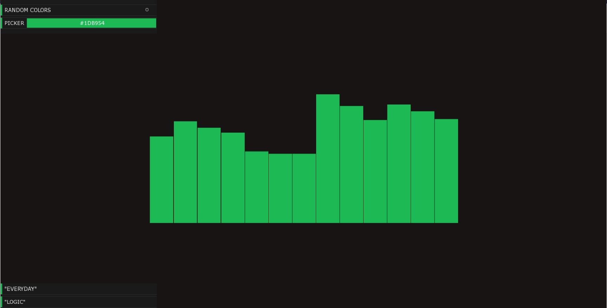

# Spotify Visualizer

Spotify Visualizer is a real-time music visualizer using the Spotify Web API for your currently playing songs. Visualizer uses the BPM and the major pitches provided by the audio analysis from Spotify. Random colors mode changes color of visualizer based on BPM of song.

# Features

* Fullscreen mode with 'F' key
* Labels for song/artist
* Color picker and random colors toggle
* Hide labels with 'H' key

# Setting Up

Clone this repository into Visual Studio and install the following software:

* [C++ REST SDK](https://github.com/Microsoft/cpprestsdk) Install CPPRestSdk for Visual Studio. Right click the project in Visual Studio -> Manage NuGet Packages -> Browse and install the latest CppRestSdk package.
* [OpenFrameworks](http://openframeworks.cc/download) Download openframeworks for Visual Studio and use the [Project Generator](http://openframeworks.cc/learning/01_basics/create_a_new_project/) to add the following addons: ofxGui and [ofxDatGui](https://github.com/braitsch/ofxDatGui).
